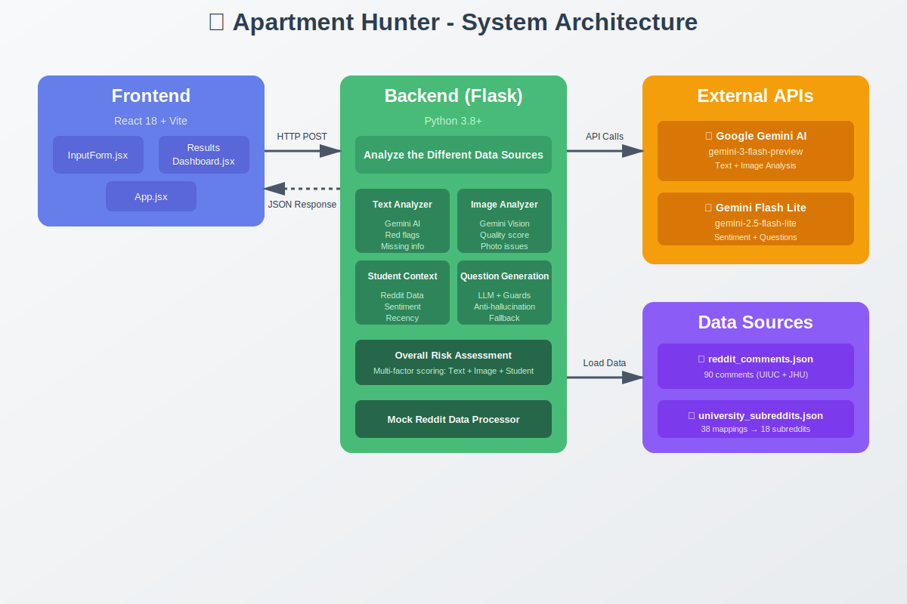
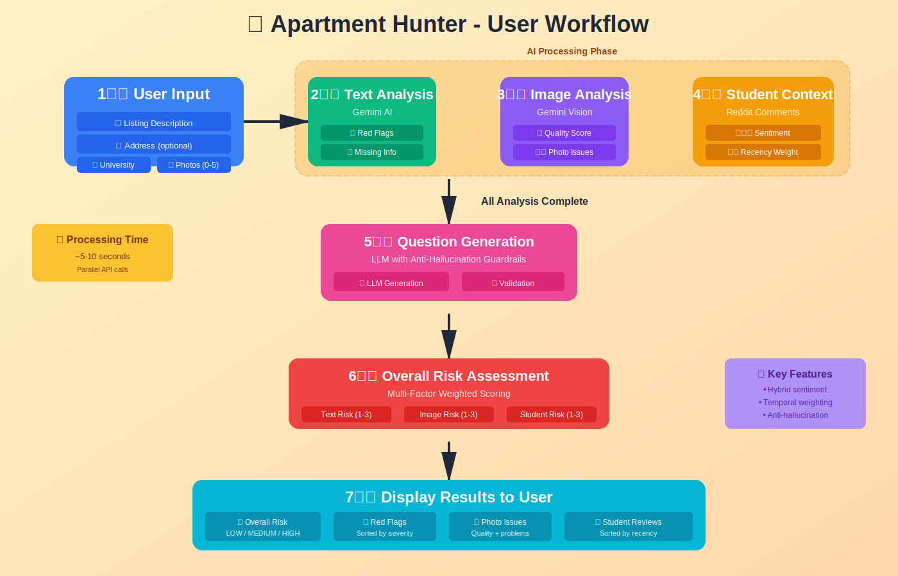

# 🏠 Apartment Hunter

**AI-powered apartment listing analyzer to help college students make informed rental decisions**

Built with Google Gemini AI, React, and Flask • Designed for students tired of misleading apartment listings

---

## 📋 Table of Contents

- [Overview](#overview)
- [Tech Stack](#tech-stack)
- [Architecture](#architecture)
- [Mock Dataset Design](#mock-dataset-design)
- [Setup & Installation](#setup--installation)
- [Usage](#usage)
- [Potential Extensions](#potential-extensions)

---

## Overview

**The Problem:** College students searching for off-campus housing often rely on listing photos and descriptions that can be misleading. Wide-angle lenses exaggerate room size, strategic cropping hides issues, and vague language obscures important details. Students frequently sign leases only to discover the apartment doesn't match expectations—leading to costly deposits and year-long commitments. Critical information about neighborhood safety, transit access, and livability is scattered across many different Reddit posts, making it hard to evaluate a property holistically before committing.

**Solution:** Apartment Hunter analyzes apartment listings using a combination of listing text, photos, and student community feedback to surface potential red flags and unknowns. The goal is not to recommend apartments, but to surface uncertainty and risk before a lease is signed.

**Core Features:**
- **Text Analysis** - Gemini AI identifies vague language, missing info, and suspicious patterns in listing descriptions
- **Photo Analysis** - Detects wide-angle distortion, poor quality, and potentially misleading images
- **Student Context** - Aggregates sentiment from university subreddit discussions (mock data)
- **Smart Questions** - Generates priority-ranked questions to ask landlords, with anti-hallucination guardrails

### Why This Project?

This is a **personal experience** turned into a demo project. After experiencing misleading apartment listings firsthand—only learning the true state of the neighborhood, certain problems with the apartment condition that were not visible in the photos ... etc and unit after signing the lease — I wanted to build something that could help other students make more informed decisions.

---

## Tech Stack

| Layer | Technology | Why |
|-------|------------|-----|
| **Frontend** | React 18 + Vite | Modern UI with instant HMR; Vite over CRA for faster dev server |
| **Styling** | Vanilla CSS | CSS capability (flexbox, grid, variables) without framework overhead |
| **Backend** | Flask 3.0 | Lightweight and familiar; right-sized for this scope |
| **AI** | Google Gemini API | Text and image analysis via `google-generativeai` SDK |
| **Data** | Mock Reddit JSON | Reddit API requires pre-approval (Nov 2025 policy); mock data demonstrates the feature |

---

## Architecture



### User Workflow



### Data Flow

1. User pastes listing text, uploads photos, selects university
2. Frontend sends FormData to `/api/analyze`
3. Backend runs 3 analyzers in parallel (text, image, student context)
4. Question generator combines findings into targeted landlord questions
5. Risk assessment calculates overall score from all dimensions
6. Frontend renders color-coded dashboard with results

### Key Algorithms

#### 1. Hybrid Sentiment Analysis

Classifies Reddit comments as positive/negative/neutral using a cost-optimized approach: **rules for obvious cases, LLM for nuanced ones**.

Every comment is scored using weighted keyword matching. College-specific phrases ("sketchy", "close to campus") carry 3x weight, strong words ("terrible", "amazing") carry 2x, moderate words carry 1x. Negations reduce confidence.

- **Tier 1 (80%):** Score ≥ 3 or ≤ -3 → classify with rules only (no API call)
- **Tier 2 (15%):** Low confidence → call Gemini for nuanced understanding
- **Tier 3 (5%):** LLM fails → fall back to rules

**Example:** *"Location is great but thin walls make studying impossible. 4/10"* — mixed signals route to Tier 2, LLM returns `negative` (studying impact outweighs location).

**Result:** ~80% cost savings vs calling LLM for every comment.

#### 2. Student Score Calculation

The 1-5 star score uses recency-weighted sentiment. Recent comments matter more—a 2-year-old construction complaint isn't relevant if construction finished.

- Less than 2 months: 1.5x weight
- 2-6 months: 1.2x weight
- 6-12 months: 1.0x weight
- Greater than 12 months: 0.7x weight

Score maps weighted sentiment ratios to a 1-5 scale (>50% negative → 2.0, >50% positive → 4.5).

#### 3. Overall Risk Assessment

Combines three dimensions to prevent any single good factor from masking issues:

- **Text Risk** (1-3): Based on Gemini's red flag analysis
- **Image Risk** (1-3): Based on photo quality score
- **Student Risk** (1-3): Based on negative comment ratio

Final risk = average of all 3: 
- ≤ 1.5 → LOW
- ≤ 2.5 → MEDIUM
- \> 2.5 → HIGH

**Example:** 4 red flags (text = 3) + mediocre photos (image = 2) + positive reviews (student = 1) = avg 2.0 → **MEDIUM Risk**

#### 4. Question Generation with Anti-Hallucination

Generates landlord questions using LLM, with strict validation to prevent hallucinated questions.

1. Tag all findings with unique IDs (`text_flag_0`, `photo_issue_0`, etc.)
2. LLM generates questions, each must reference valid flag IDs
3. Validate every flag_id exists; reject hallucinations
4. If \> 50% rejected or \< 50% coverage, fall back to listing all flags as bullets

**Example:** LLM generates "Is there a pool?" referencing `amenity_pool` — rejected because that flag doesn't exist. User only sees valid questions.

---

## Mock Dataset Design

Since Reddit's API requires pre-approval (Nov 2025 policy change), we created a curated mock dataset that demonstrates the feature while reflecting realistic student discourse patterns.

### Design Choice

The dataset was intentionally crafted to test the sentiment analysis system across the full spectrum of real Reddit commentary:

**Sentiment Distribution:**
- **~30% Strongly Positive** - Enthusiastic reviews ("Amazing location, super close to campus, highly recommend!")
- **~30% Strongly Negative** - Clear complaints ("Terrible landlord, roaches everywhere, avoid at all costs")
- **~40% Mixed/Neutral** - The challenging cases that test our hybrid system ("It's fine I guess, location is good but walls are thin")

**College-Specific Language:**

Real student Reddit posts use distinctive vocabulary that generic sentiment models miss. Our dataset and keyword weights include:

| Phrase | Sentiment | Why It Matters |
|--------|-----------|----------------|
| "sketchy" | Negative | College slang for unsafe/suspicious |
| "clutch" | Positive | Slang for convenient/perfect |
| "thin walls" | Negative | Common dorm/apartment complaint |
| "close to campus" | Positive | Top priority for students |
| "parking nightmare" | Negative | Specific pain point |
| "responsive landlord" | Positive | Key for student renters |

**User Type Diversity:**
- Undergraduate perspectives (price-sensitive, social-focused)
- Graduate student perspectives (quiet-focused, longer-term)

**Temporal Spread:**
- Comments distributed from 1 month to 18 months old
- Tests recency weighting algorithm

### Dataset Stats

- **90 comments** across 9 categories (location, safety, noise, landlord, building condition, pricing, etc.)
- **2 universities** with specific data (UIUC, Johns Hopkins)
- **38 university name mappings** → 18 subreddits
- **No pre-labeled sentiment** — sentiment is inferred at runtime to demonstrate NLP capability

### Why This Approach?

Rather than using a small dataset with pre-labeled sentiment, we:
1. Created realistic, diverse comments that mirror actual Reddit tone
2. Built sentiment inference that works on any text (production-ready)
3. Designed for easy swap to real Reddit API when credentials are obtained

This demonstrates **working within constraints** while maintaining production-quality architecture.

---

## Setup & Installation

### Prerequisites

- Python 3.8+
- Node.js 16+
- [Google Gemini API key](https://makersuite.google.com/app/apikey) (free tier available)

### Quick Start

```bash
# Clone and enter directory
git clone <your-repo-url>
cd Bayview

# Backend setup
cd backend
python3 -m venv venv
source venv/bin/activate  # Windows: venv\Scripts\activate
pip install -r requirements.txt

# Create API key file in root
cd ..
echo "GEMINI_API_KEY=your_key_here" > gemini.env

# Frontend setup
cd frontend
npm install

# Verify backend
cd ../backend
python tests/test_backend.py
# Should see: "All tests passed! Backend is ready."
```

### Running the App

**Terminal 1 (Backend):**
```bash
cd backend && python app.py
# Server at http://localhost:5000
```

**Terminal 2 (Frontend):**
```bash
cd frontend && npm run dev
# App at http://localhost:3000
```

---

## Usage

1. **Paste listing description** from any rental site
2. **Upload photos** (optional, drag & drop up to 5)
3. **Select university** to match with relevant student reviews
4. **Click Analyze** and wait 3-5 seconds
5. **Review results:**
   - Overall risk assessment (Low/Medium/High)
   - Detected red flags and photo issues
   - Student reviews with sentiment badges
   - Smart questions to ask the landlord

---

## Potential Extensions

The current implementation is a focused prototype. Natural extensions would include:

- **Real Reddit integration** once API credentials are obtained (architecture is ready for swap)
- **Export/share results** as PDF or shareable link
- **Listing comparison** to evaluate multiple apartments side-by-side
- **Chrome extension** to analyze listings directly on rental sites as a plug-in
- **Apartment Listing Site API integration** Directly using this tool from apartment listing sites through API's (which are currently paid and only for enterprises) would create a more seamless user experience
- **Chrome extension** to analyze listings directly on rental sites as a plug-in
